# YBIGTA_newbie_team_project

## 팀 소개
- 저희 팀은 **5조**입니다.

## 팀원 소개
| 이름       | 학과                 | 학번      |
|------------|----------------------|-----------|
| 조태연     | 연세대학교 응용통계학과 | 20학번     |
| 조석희     | 연세대학교 문헌정보학과 | 20학번     |
| 엄윤희     | 연세대학교 컴퓨터과학과 | 22학번     |

---

## app 프로젝트 실행 방법
1. **bash에서 실행**:
    ```bash
    pip install -r requirements.txt
    uvicorn app.main:app --reload
    ```
2. **브라우저에서 접속**:
    - [http://127.0.0.1:8000](http://127.0.0.1:8000)

---

## GitHub PNG

### Branch Protection


---

### Push Rejected


---

### Merged
<p align="center">
    
    
    
</p>

---

## 크롤링 실행 방법 및 데이터 소개

1. **다이닝코드 리뷰 크롤링**
   - **실행 명령**:
     ```bash
     python main.py -o {output_path} -c diningcode
     ```
   - **크롤링 사이트 링크**: [https://www.diningcode.com/profile.php?rid=L4miF0diqkcW](https://www.diningcode.com/profile.php?rid=L4miF0diqkcW)
   - **리뷰 수**: 총 408개

2. **구글맵스 리뷰 크롤링**
   - **실행 명령**:
     ```bash
     python main.py -o {output_path} -c googlemaps
     ```
   - **크롤링 사이트 링크**: [https://www.google.co.kr/maps/?hl=ko](https://www.google.co.kr/maps)
   - **리뷰 수**: 총 360개

3. **카카오맵 리뷰 크롤링**
   - **실행 명령**:
     ```bash
     python main.py -o {output_path} -c kakaomap
     ```
   - **크롤링 사이트 링크**: [https://place.map.kakao.com/10332413](https://place.map.kakao.com/10332413)
   - **데이터 개수**: 총 1000개

4. **전체 크롤링 실행**
   - **실행 명령**:
     ```bash
     python main.py -o {output_path} --all
     ```
   - **설명**: 다이닝코드, 구글맵스, 카카오맵 리뷰 크롤러가 순차적으로 실행되며 모든 데이터는 지정한 `output_path`에 저장됩니다.
 
  - **크롤링 대상**: 명동교자 본점 리뷰 데이터
  - **데이터 구조**: `rating`, `date`, `content`의 3개 열로 구성
  - **데이터 저장 형식**: 모든 크롤링 데이터는 CSV 파일로 저장됩니다.
  - **저장 파일명**:
    - 다이닝코드: `reviews_diningcode.csv`
    - 구글맵스: `reviews_googlemaps.csv`
    - 카카오맵: `reviews_kakaomap.csv`

## EDA 그래프와 설명
- **특성**:
   - 날짜가 '2주 전', '3달 전'과 같이 표시된 경우 현재 시점 기준으로 계산하여 카카오맵, 다이닝코드는 연-월, 구글맵은 연단위까지 수집집
   - 1점~5점 내에 분포하는 별점
   - 각기 다른 형식으로 표현된 날짜(현재 시점 기준 상대적인 시간 표현)
   - 사이트별 별점 분포 그래프
   <p align="center">
      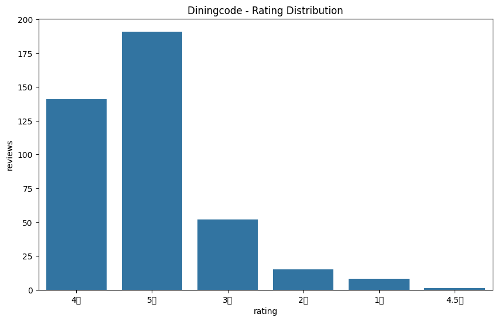
      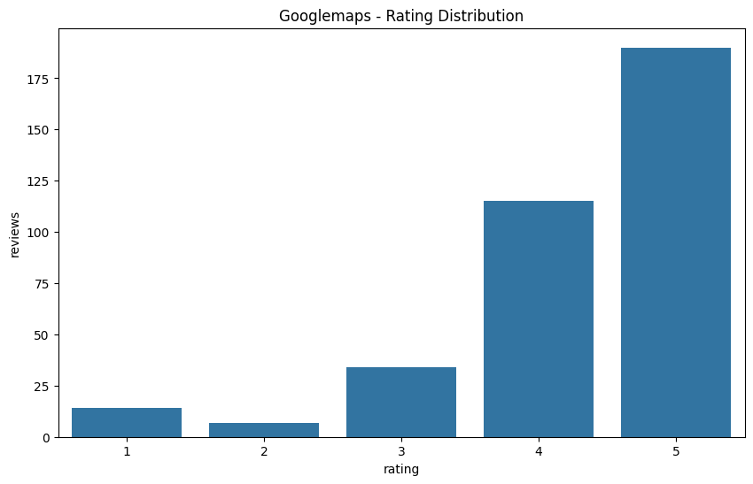
      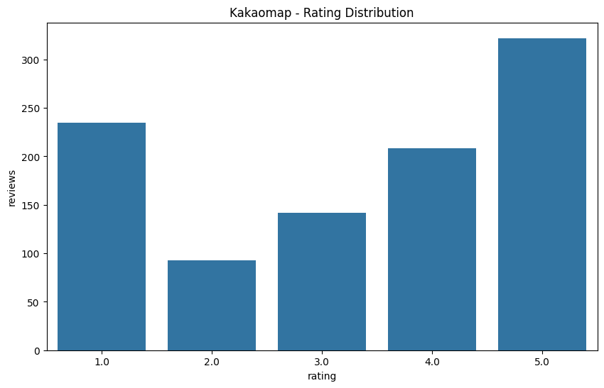
   </p>
- **결측치, 이상치 탐색**:
   - 별점, 날짜만 존재하며 내용은 작성되지 않은 경우
   - 정확한 날짜가 나타나 있지 않은 경우

## 전처리/FE 결과
- **결측치**: 내용이 없는 리뷰의 경우 별점에 따라 긍/부정이 나타나는 내용으로 대체
- **이상치**: 형식에 맞지 않은 날짜를 정규화하여 일관되게 표현
- **텍스트데이터 전처리**: 내용의 특수 문자 제거, 비정상적으로 긴 리뷰 길이 제한
- **파생변수**: 계절에 따른 파생변수 생성
- **FE**: 문맥 파악에 용이한 BERT 모델을 사용하여 텍스트 벡터화

---

## 리뷰 분석 그래프

### 1. 빈출 단어 분석

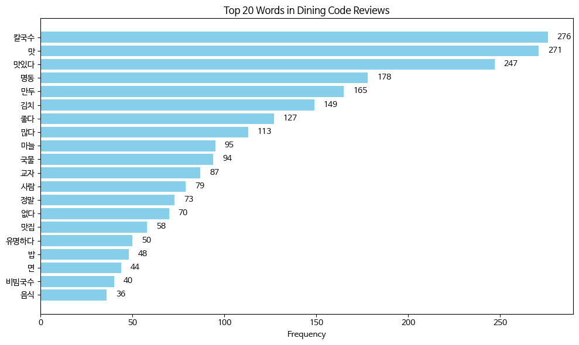

> 다이닝코드 리뷰에서는 **칼국수, 맛있다, 만두, 김치, 마늘, 국물** 등의 단어가 빈출되었습니다. 

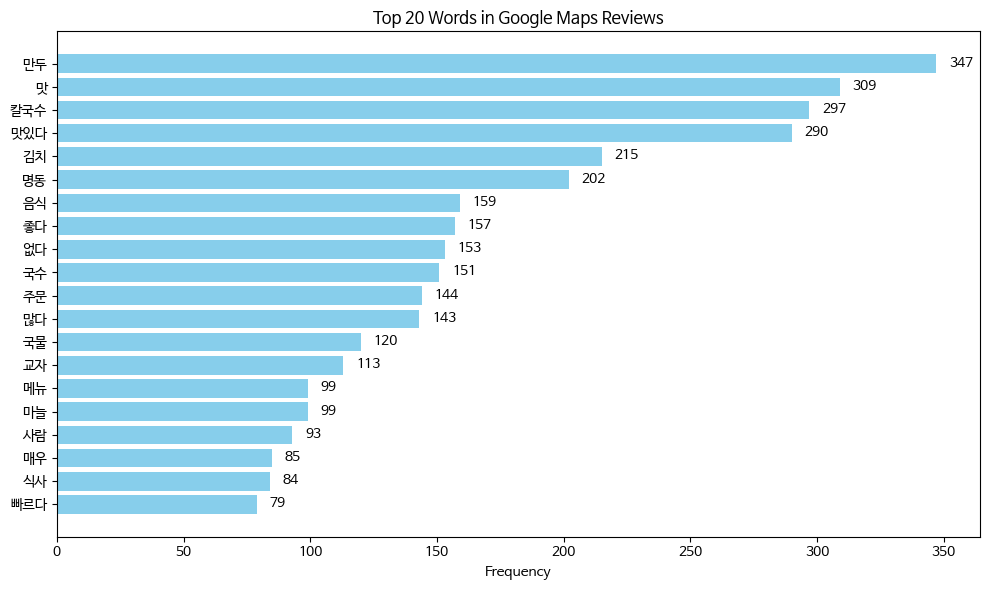

> 구글맵스 리뷰에서는 **만두, 맛있다, 칼국수, 김치, 국수** 등의 단어가 빈출되었습니다.

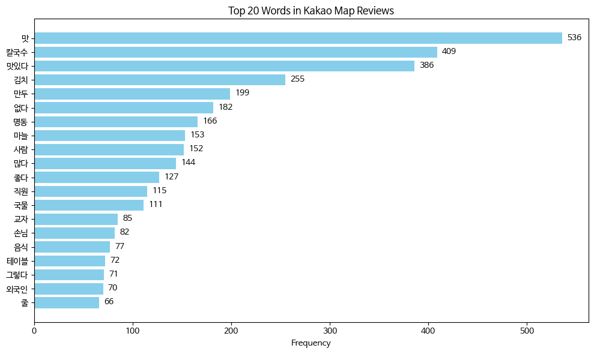

> 카카오맵 리뷰에서는 **맛, 칼국수, 김치, 만두, 마늘** 등의 딘어가 빈출되었습니다.

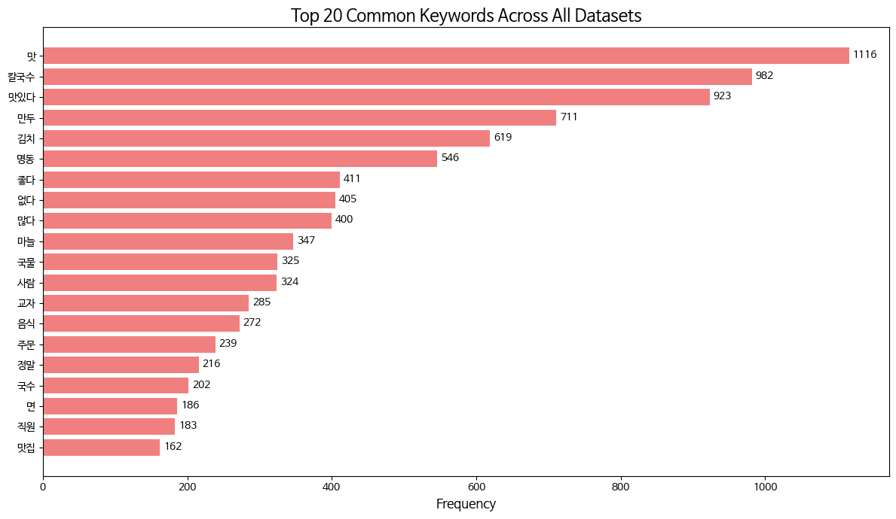

> 종합적인 리뷰에서는 **맛, 칼국수, 만두, 김치, 마늘** 등의 단어가 빈출되었습니다.

---

### 2. 감성 분석
- 각 플랫폼에서 긍정/부정/중립 리뷰 비율을 나타낸 파이차트입니다.
<p align="center">
    
    
    
</p>

- 각 플랫폼에서 긍정/부정/중립 리뷰 비율을 나타낸 그래프입니다.


> 카카오맵 리뷰에서 부정적인 리뷰가 비교적 많이 작성되었음을 확인할 수 있습니다.

- 각 플랫폼에서 긍정/부정/중립 리뷰의 리뷰 길이 평균을 나타낸 그래프입니다.


> 다이닝코드, 구글맵스에서 긍정, 부정 리뷰의 길이가 유사하게 나타났습니다. 카카오맵에서는 부정적인 리뷰가 긍정적인 리뷰에 비해 길게 작성되었습니다.

- 각 플랫폼에서 각 리뷰의 별점과 긍정(4, 5점), 부정(1, 2점) 감성의 일치 정도를 나타낸 그래프입니다.
<p align="center">
    
    
    
</p>

---


### 3. 시계열 분석

- **GoogleMaps**
- 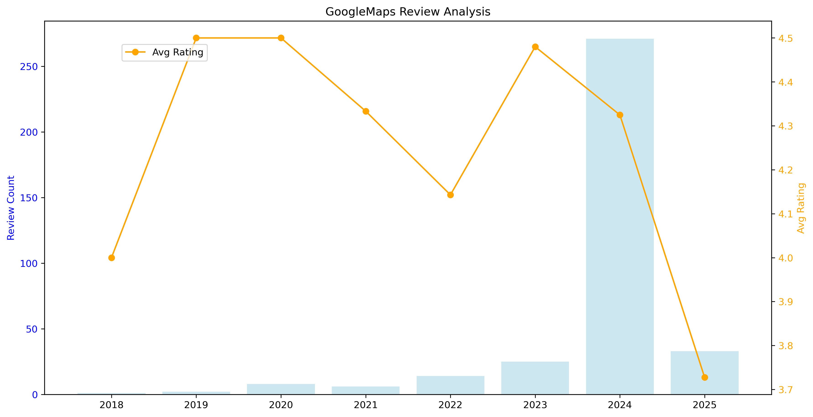
- **분석 내용**: 
  - 리뷰 데이터 중 `1년 전`, `2년 전`과 같이 특정 날짜 정보를 알 수 없는 경우, **year 단위**로만 분류하여 분석.
  - 시간 흐름에 따른 리뷰 개수와 평균 별점의 변화 관찰.

---

- **KakaoMap**
- 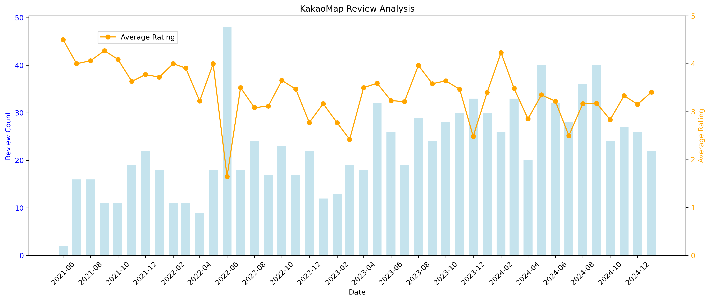
- **분석 내용**: 
  - 리뷰 데이터는 **2021년부터 2025년 1월**까지의 데이터를 대상으로 분석.
  - 리뷰 데이터를 **month 단위**로 분류하여 시간 흐름에 따른 변화 확인.

---

- **DiningCode**
- 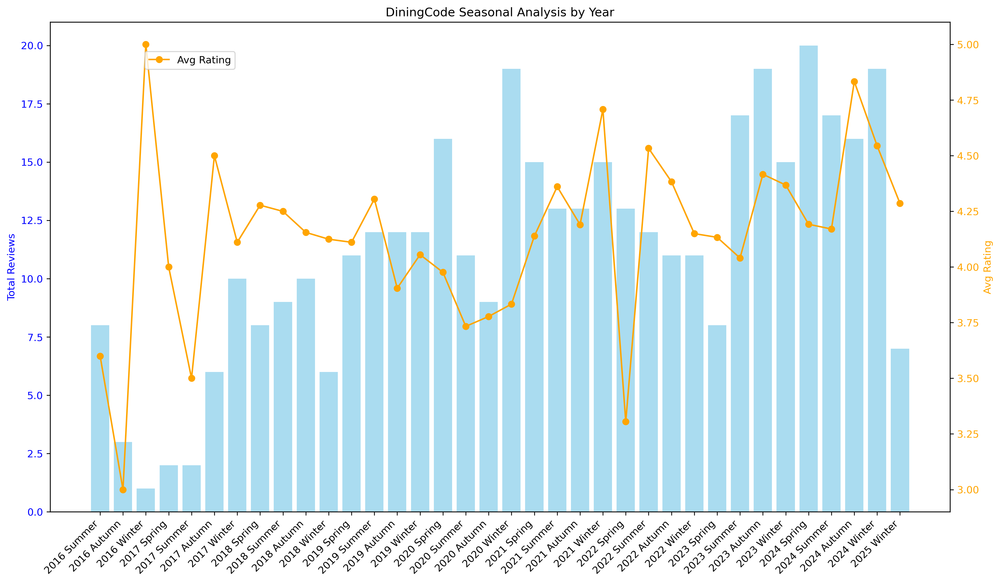
- **분석 내용**: 
  - **2016년부터 2025년 1월**까지의 데이터를 대상으로 분석.
  - KakaoMap과의 비교를 위해 **계절 단위(봄, 여름, 가을, 겨울)**로 데이터를 분류하여 분석.
  - month 단위로 분류한 추가적인 그래프는 `review_analysis/plots` 디렉토리를 참조.

---

- **종합 분석**
  - **리뷰 개수 추세**:
    - KakaoMap과 DiningCode 모두 시간이 지남에 따라 리뷰 개수가 **꾸준히 증가**하는 경향을 보임.
    - DiningCode의 경우, **2020년대 리뷰 수**가 전년도 및 후년도와 비교하여 소폭 감소. 이는 **COVID-19**와 같은 외부 요인의 영향을 받은 것으로 추정됨.

  - **평균 별점 추세**:
    - DiningCode의 평균 별점은 **2018년 이후 4.25** 수준을 안정적으로 유지.
    - KakaoMap은 **2021년부터 평균 별점 4점대**를 기록하였으나, 시간이 지남에 따라 점차 낮아지는 추세를 보임.

  - **계절적 패턴**:
    - 리뷰 수와 평균 별점의 **계절적인 변화**는 뚜렷하지 않음. 이는 리뷰 작성이 특정 계절에 국한되지 않고 연중 고르게 분포하고 있음을 시사.
---

### Docker Hub Repository  
본 프로젝트의 Docker 이미지는 아래 Docker Hub에서 확인할 수 있습니다.
**Docker Hub:** [joetae/docker-image](https://hub.docker.com/r/joetae/docker-image)

## API 실행 결과

<p align="center">
    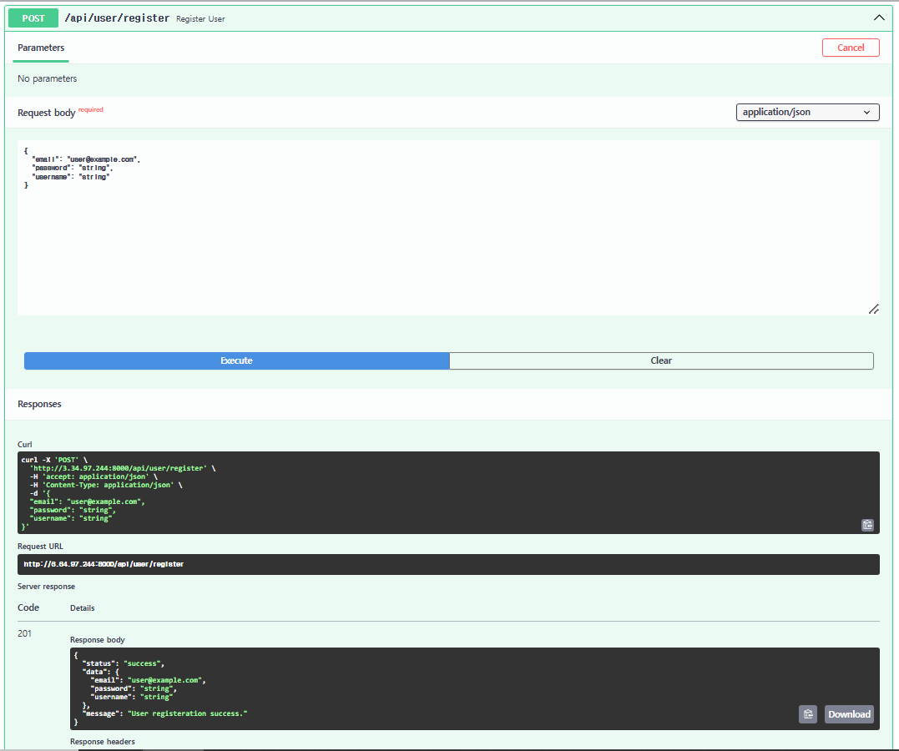
    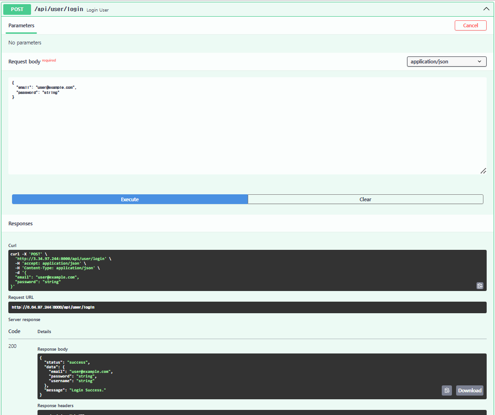
</p>

<p align="center">
    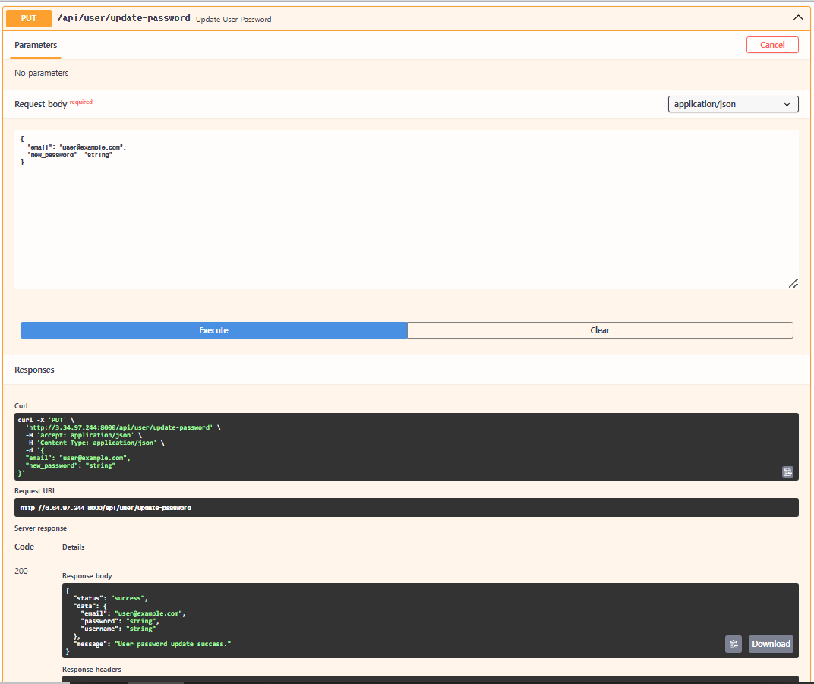
    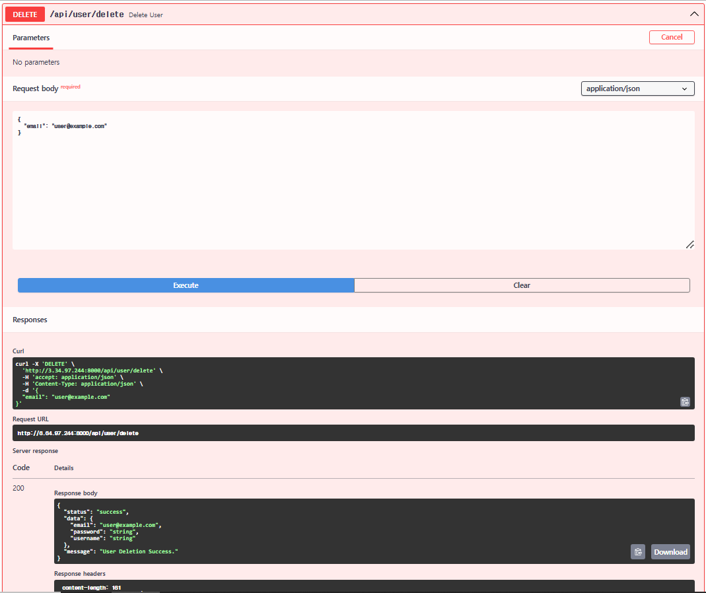
    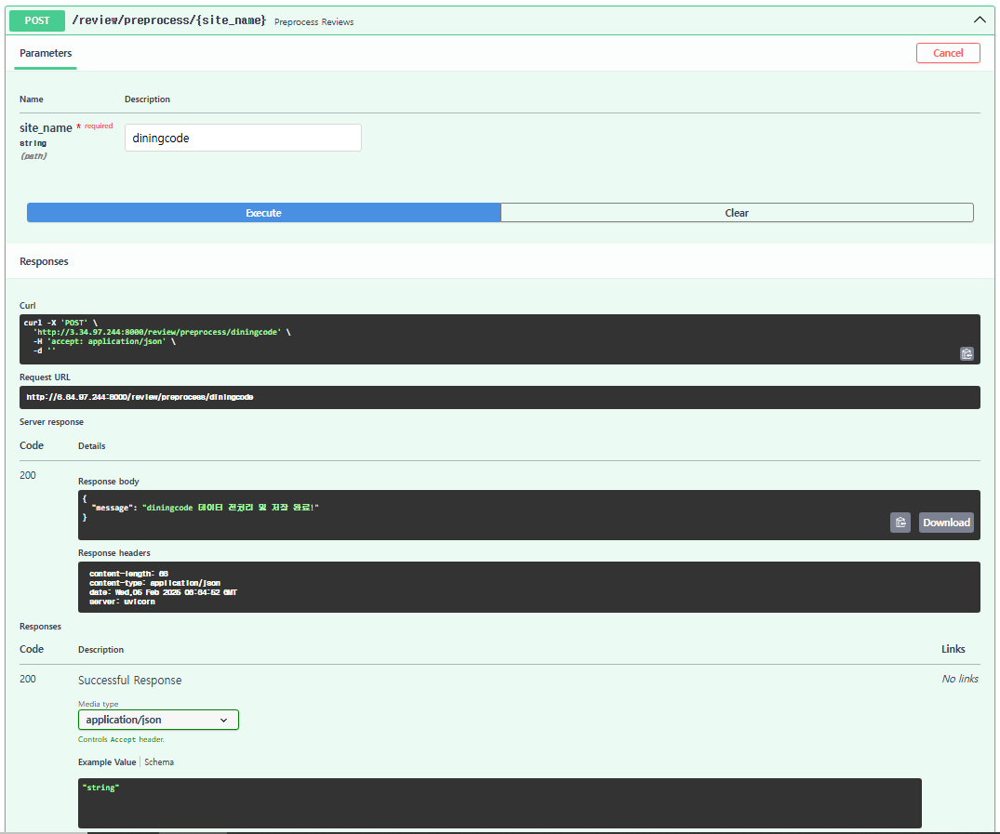
</p>

## Github Actions 실행
<p align="center">
    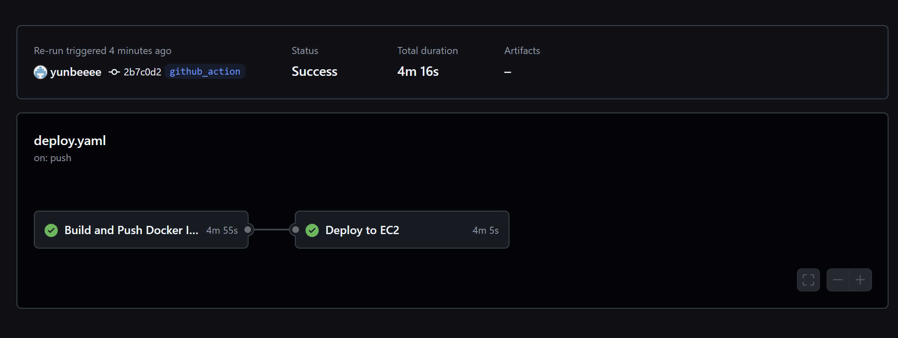
</p>